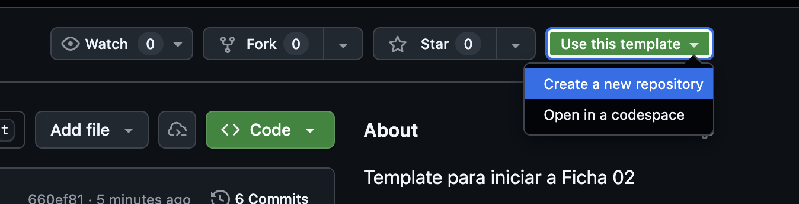
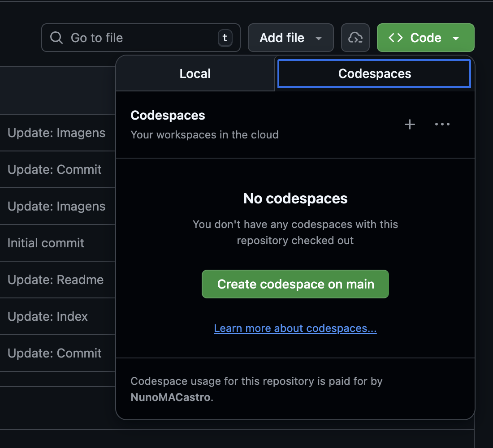

# Índice de Fichas e Resoluções — 12.º Téc. Inf. de Gestão (E.P. Mariana Seixas)

Repositório central com os links para as fichas, respetivas resoluções e material teórico alojadas noutros repositórios GitHub. Conteúdos dos módulos: Node.js, Express, EJS, MongoDB e React.

## Material Teórico

[Material Teórico](https://github.com/NunoMACastro/edu-docs-3ig-js-guias-2526 "Material Teórico")

## Índice de Fichas

| Tema/Stack                       | Ficha                                                                          | Resolução           |
| -------------------------------- | ------------------------------------------------------------------------------ | ------------------- |
| Ficha 2: Node.js · Express · EJS | [Template - Ficha 2](https://github.com/NunoMACastro/temp-3ig-js-ficha02-2526) | Ainda sem resolução |
| Ficha 3                          | Em breve...                                                                    | Ainda sem resolução |
| Ficha 4                          | Em breve...                                                                    | Ainda sem resolução |
| Ficha 5                          | Em breve...                                                                    | Ainda sem resolução |

---

## Como usar

-   Encontra aqui o atalho para cada ficha e solução publicada.
-   Cada repositório das fichas tem um template para a estrutura base dessa ficha.
-   Instruções:

    -   Abre o repositório da ficha que pretendes fazer.
    -   Lê o README para entender os requisitos.
    -   Clica na seta junto botão "Use this template" e seleciona "Create a new repository".

    

    -   Preenche os dados do novo repositório e clica em "Create repository from template".
    -   Depois podes trabalhar localmente ou diretamente no GitHub usando o CodeSpaces.

    

    -   Se quiseres trabalhar localmente, faz clone do repositório que criaste

-   Usa nomes descritivos para os repositórios das fichas (ex.: `ficha-03-node-routing`).
